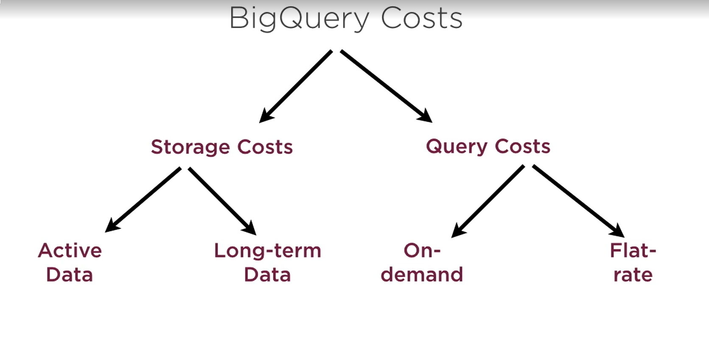
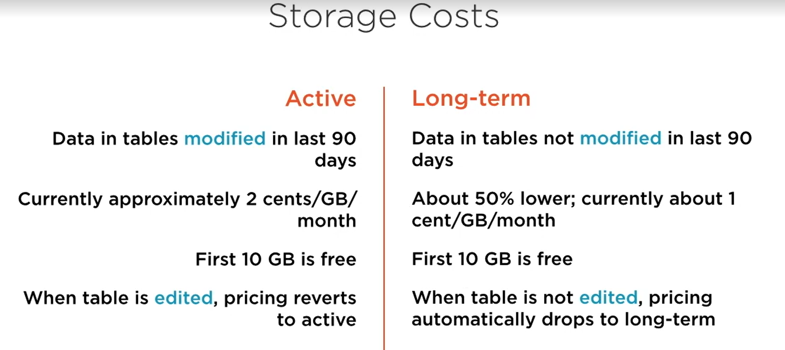

# BigQuery

- is a cloud data warehouse
- standard SQL and ODBC/JDBC driers
- serverless
- no cluster, no servers
- "No-ops" - not even indices
- Autoscaling right to Petabytes
- Streaming and real-time analytics

# Where BigQuery fits

- pricing
- Comparison to other GCP technologies

# BigQuery Data Model

- Datasets, tables and views
- Partitioned tables

# Advanced Analytical Queries

- Nested and repeated fields
- Aggregate and window operation

# Programmatic Access

- client programs, Datalab notebooks

# Cloud SQL Vs BifQuery

| BigQuery                       | Cloud SQL                            |
|:-------------------------------|--------------------------------------|
| scales to Petabytes            | Tops out at 20 TB                    |
| serverless                     | requires cluster provisioning        |
| No-ops e.g no indices          | Manual design schemas, build indices |
| Automatic high-variability     | Hih-availability needs configuration |
| No ACID or transaction support | String ACID and transaction support  |
| SQL access                     | SQL access                           |
| week schema enforcement        | String schema enforcement            |

# BigQuery (SQL) Vs DataStore (NoSql)

| BigQuery           | DataStore                            |
|--------------------|--------------------------------------|
| Scales to petabyte | more effective at terabyte scale     |
| Serverless         | Serverless                           |
| Relation data      | Document-oriented                    |
| SQL access         | noSQL technology                     |
| Analytical queries | Hierarchical queries e.g. In XML     |
| OLAP               | OLAP but has transaction support too |

OLAP => Online analytic processing

# Cost

