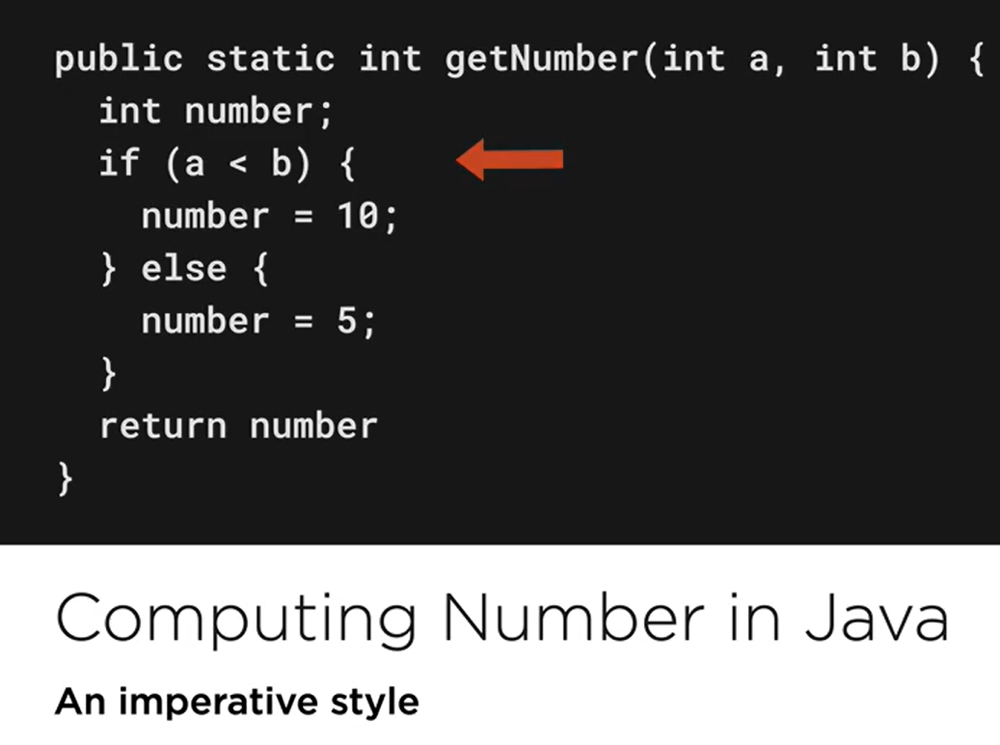
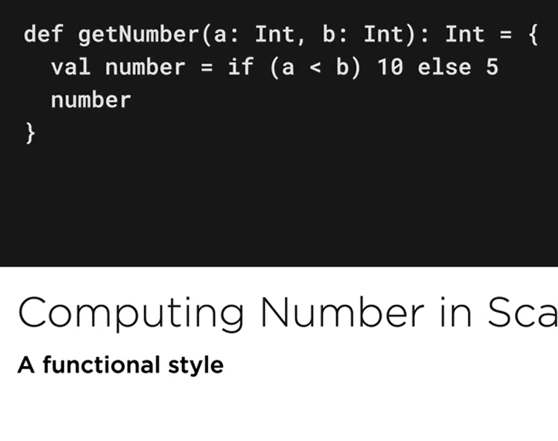
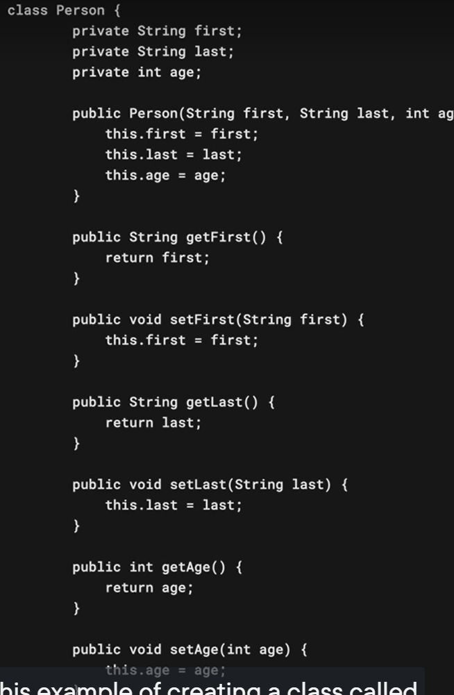
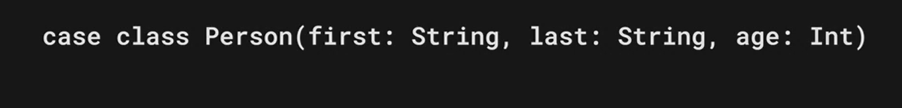

# Scala

[Tutorial](https://app.pluralsight.com/course-player?clipId=c10a6709-b8cc-44b4-87b1-b9768b69cff5)

- General-purpose programing language
    - Finance
    - healthcare
    - education
- Object oriented
- Functional
- Strong type system
    - meaning the scala compiler will check if all val... are correct
- Infer types
- [scala type system](#scala-type-system)

# Problems Scala solves

- [Functional over imperative style Expressions](#expression)
- [Multiple inheritance using Traits](#Traits)
- better concurrency support
- [less verbosity, higher developer productivity](#less verbosity)
- [Advantages ](#Advantages )

# Expression

In java, we use statement if we want to calculate a number
the if it doesn't return anything, but we assign the number in the statement


while in scala condition like if and looping with for are expression
meaning they will return a value


# Traits

They are like java interfaces but much more powerfull.
The traits allow mutiple inheritance, the dyamond problem i solved wth the concept of
literalization,

### literalization

allows multiple inheritance and stackabke modifications

# less verbosity

A person clas in java

Same class but on scala

We can build that person on one line
and we still get more from that like

- immutable instances
- pattern matching
- instance cloning

# Advantages

- a blend of object-oriented and functional program
- A concise and expressive language (less code)
- Interoperable with java
    - scala is available everywhere java is
    - easily to integrate scala into java project
- Strongly typed language

# Disadvantages

- A high learning curve
- Takes a long time to compile
    - Dotty a new feature at v3 to handle this problem
- Smaller talent pool to hire

# Scala type system

- any (Root)
    - AnyVal
        - (instances are not represented as obj)
        - object creation is avoided at runtime
        - Types
            - Double
            - Float
            - Long
            - int
            - Short
            - Byte
            - Unit
            - Boolean
            - char
    - anyRef(ins represented as obj)
      -Null is subtype of evry anyRef
      Every object inherits from any
-
- Noting
    - is at the bottom and is the subtype of every type.
    - doesn't have any instances
    - one usage is to use it as return type when computation doesn't happen normally, to signal failures


## Unit

Mostly used in functions to represent the absence of return value
Same as void on other languages

## Value casting


## Expression

expression yields a value
`getSquareOf(num)`

- easy to test
- no side effects

## Statement

Statement is a line of code that does something
`println("hello")`

- may contain side effect
    - writing to files
    - connection to network etc.

## Match

Like switch in java
to use default we use
`case _` where _ stands match anything

- If there is no match at all a MatchError is thrown
- we can use variable latter on in the exectuin

`
amount match{
<cse> <value> <guards> => <statement>
case a if a==50 => print... +a
case a if a==100 => print... + a
case a => print... //this is like default value
`
-[ Pattern matching ](../src/main/scala/Match.sc)

# Functions

- inside a class they are known as methods
- outside a class they are known as functions

```
<def> <name> (<args>) [return type optional] {body}
def functionName (argument: Type) : Return Type {body}
```
