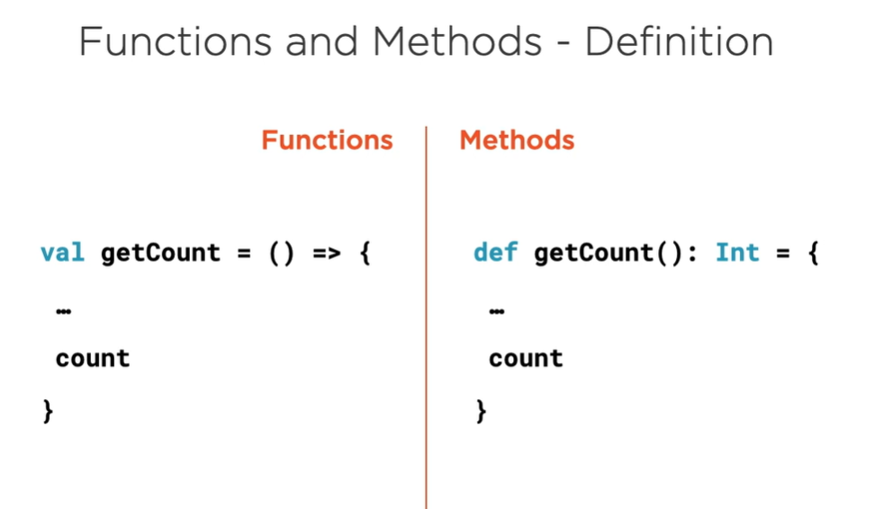
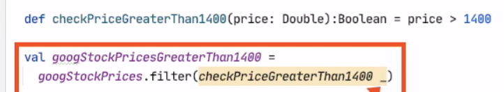
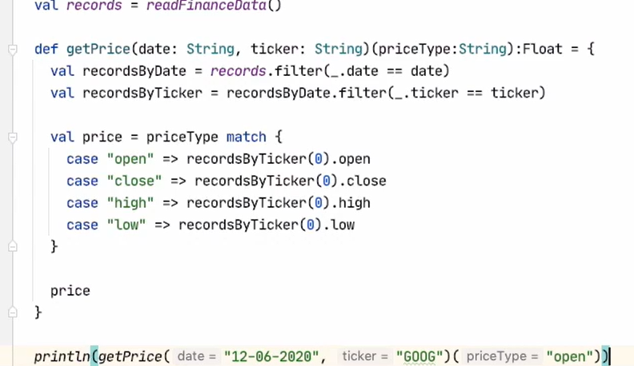

# Functions and methods

- Reusable unit of code
- executed when invoked
- can accept input args
- may return a result

# Methods

- are not objects
- stored into objects
- not first class entities
- associated with a class
- defined as a part of a class
- has a name, signature, annotations
- always has a name
- always invoked using name specified at definition
- slightly faster and better performing
- work fine with type parameters and parameters default value

# Functions

- are object
- not explicitly associated with a class
- Complete standalone object
    - which is an instance of a class
- can be treated likely any other object that you instantiate in scala
- Implements trails in Scala
- has its own methods
- Can be stored in val and var storage units
- can be anonymous
- can be assigned to a val or var type which is used to invoke the function
- slightly slower, higher overhead
- are first class entities on par with classes
- (Generics) not accept type parameters or default values
- return type can be a function
- params can be function



# Partially applied function | Convert method to function


This is a partially applied function, where you do not supply
all the args the function needs, you specify somme or none of them

# [Partial function](../PartialFunctions.scala)

Partial function are different from partially applied function

A partial function is any function caters to only a subset of possible data for
which it has been defined

```scala worksheet

// a partial function which doesn't accepts 0 as args
val divide64By = new PartialFunction[Int, Int] {
  override def apply(x: Int): Int = 64 / x

  override def isDefinedAt(x: Int): Boolean = x != 0
}

```

# Function literal

ex `()=>...`

```scala worksheet
val googleStacksPrice = List(15615.5, 4561, 5167, 3515.5, 51534.4)
// price=> println(price) is a function literal
googleStacksPrice.foreach(price => println(price))

```

# PlaceHolders

- represented with ``_``

Placeholders in scala represented with `_` symbol hold ine or more parametters
to be passed into a function

```scala worksheet
val googleStacksPrice = List(15615.5, 4561, 5167, 3515.5, 51534.4)
//filtering
googleStacksPrice.filter(price => price > 14000)
//or
googleStacksPrice.filter(_ > 14000)
```

# Invoking function

invoking a function without apply is same as invoking it with apply

```scala worksheet
val f = () => println("invoked")

f()
// or
f.apply()
```

`f()` is same as `f.apply()`

# High order functions

High order functions are function that:

- takes as args other function
- return another function

High order functions are function which have other functions
as argument or functions that return other functions

# Curried function

A curried function has multiple args list - this is equivalent
to multiple function invocations back. The first function accepts
2 args, the second function accepts one.



# Procedure

a method without `=` is called a procedure.

A procedure does not return anything, its result type is always Unit